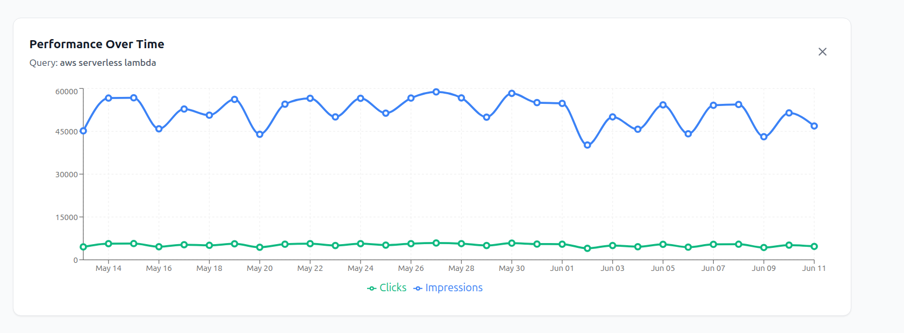

# Search Analytics Dashboard

A comprehensive React + TypeScript dashboard for monitoring and analyzing search performance metrics. Built with GraphQL integration, interactive charts, and a beautiful, responsive UI.



## 🚀 Features

- **Date Range Selection**: Pick custom date ranges with an intuitive date picker (defaults to last 30 days)
- **Interactive Metrics Table**: View top 20 queries with sortable columns for Clicks, Impressions, CTR, and Position
- **Real-time Filtering**: Filter queries by substring with instant results
- **Performance Charts**: Detailed time-series visualization showing clicks and impressions over time
- **Responsive Design**: Optimized for desktop, tablet, and mobile devices
- **Loading States**: Smooth loading animations and error handling
- **TypeScript**: Full type safety throughout the application

## 🛠 Tech Stack

- **Frontend**: React 18 with TypeScript
- **State Management**: React hooks + Apollo Client
- **GraphQL**: Apollo Client for data fetching
- **Charts**: Recharts for interactive visualizations
- **Styling**: Tailwind CSS with custom components
- **Icons**: Lucide React
- **Testing**: Vitest + React Testing Library
- **Build Tool**: Vite

## 📋 Architecture

### Project Structure
```
src/
├── components/          # Reusable UI components
│   ├── DateRangePicker.tsx
│   ├── MetricTable.tsx
│   ├── QueryFilter.tsx
│   ├── DetailChart.tsx
│   └── LoadingSpinner.tsx
├── hooks/              # Custom React hooks
│   ├── useSearchAnalytics.ts
│   └── useDateRange.ts
├── types/              # TypeScript type definitions
│   └── analytics.ts
├── graphql/            # GraphQL queries and client setup
│   ├── queries.ts
│   └── client.ts
├── utils/              # Utility functions
│   └── dateUtils.ts
├── mocks/              # Mock data for development
│   └── mockData.ts
└── __tests__/          # Test files
    ├── components/
    └── hooks/
```

### Design Decisions

1. **Component Architecture**: 
   - Small, focused components with single responsibilities
   - Props interfaces for type safety
   - Consistent styling patterns using Tailwind

2. **State Management**:
   - Apollo Client for GraphQL state and caching
   - Local React hooks for UI-specific state
   - Custom hooks for shared logic (date ranges, analytics)

3. **Data Fetching**:
   - GraphQL with Apollo Client for efficient data fetching
   - Mock implementation for development (easily replaceable with real API)
   - Error boundaries and loading states

4. **Styling Approach**:
   - Tailwind CSS for utility-first styling
   - Custom color system with semantic colors
   - Responsive design with mobile-first approach
   - Micro-interactions and hover states

5. **Testing Strategy**:
   - Unit tests for components and hooks
   - Integration tests with Apollo MockedProvider
   - Focus on user interactions and data flow

## 🚀 Getting Started

### Prerequisites
- Node.js (v18 or higher)
- npm or yarn

### Installation

1. Clone the repository:
```bash
git clone <repository-url>
cd search-analytics-dashboard
```

2. Install dependencies:
```bash
npm install
```

3. Start the development server:
```bash
npm run dev
```

4. Open [http://localhost:5173](http://localhost:5173) in your browser

### Available Scripts

- `npm run dev` - Start development server
- `npm run build` - Build for production
- `npm run preview` - Preview production build
- `npm run test` - Run tests
- `npm run test:ui` - Run tests with UI
- `npm run lint` - Run ESLint

## 🧪 Testing

Run the test suite:
```bash
npm run test
```

The project includes:
- **Component tests**: Testing UI behavior and interactions
- **Hook tests**: Testing custom hooks with Apollo mocks
- **Integration tests**: Testing component + data flow

### Test Coverage
- MetricTable component with sorting and selection
- useSearchAnalytics hook with GraphQL integration
- Date formatting and utility functions

## 🔗 GraphQL Integration

The application is designed to work with a GraphQL endpoint at `https://api.example.com/graphql` using this query structure:

```graphql
query GetSearchAnalytics($startDate: String!, $endDate: String!, $queryFilter: String) {
  searchAnalytics(startDate: $startDate, endDate: $endDate, filter: $queryFilter) {
    topQueries(limit: 20, sortBy: CLICKS_DESC) {
      query
      clicks
      impressions
      ctr
      position
    }
    timeSeries(query: $queryFilter, dimensions: ["date"]) {
      date
      clicks
      impressions
    }
  }
}
```

### Mock Implementation
Currently uses a mock GraphQL client that simulates API responses with realistic data. To connect to a real API:

1. Update `src/graphql/client.ts` to use `createHttpLink`
2. Replace the mock link with the real endpoint
3. Add authentication headers if required

## 🎨 Design System

### Color Palette
- **Primary**: Blue variants for main actions and highlights
- **Success**: Green for positive metrics (high CTR, good positions)
- **Warning**: Yellow for moderate performance
- **Error**: Red for poor performance
- **Neutral**: Gray scale for text and backgrounds

### Typography
- **Headings**: Inter font with proper hierarchy
- **Body**: Consistent line heights (150% for readability)
- **UI Elements**: Clean, readable font sizes

### Spacing
- 8px grid system for consistent spacing
- Proper visual hierarchy with intentional white space

## 🚀 Production Deployment

1. Build the application:
```bash
npm run build
```

2. The `dist` folder contains the optimized production build

3. Deploy to your preferred hosting service (Vercel, Netlify, etc.)

## 🔮 Future Enhancements

With more time, I would implement:

1. **Advanced Filtering**: 
   - Multiple filter criteria
   - Date-based filtering
   - Performance threshold filters

2. **Export Functionality**:
   - CSV/Excel export
   - PDF reports
   - Scheduled reports

3. **Real-time Updates**:
   - WebSocket integration
   - Auto-refresh capabilities
   - Live data streaming

4. **Advanced Analytics**:
   - Trend analysis
   - Comparative metrics
   - Predictive insights

5. **User Management**:
   - Authentication
   - Role-based access
   - User preferences

6. **Performance Optimization**:
   - Virtual scrolling for large datasets
   - Data pagination
   - Optimistic updates

## 🤝 Contributing

1. Fork the repository
2. Create your feature branch (`git checkout -b feature/amazing-feature`)
3. Commit your changes (`git commit -m 'Add some amazing feature'`)
4. Push to the branch (`git push origin feature/amazing-feature`)
5. Open a Pull Request

## 📝 License

This project is licensed under the MIT License.

---

**Time Invested**: ~4 hours for this polished MVP
**Focus Areas**: Clean architecture, beautiful UI, comprehensive testing, thorough documentation